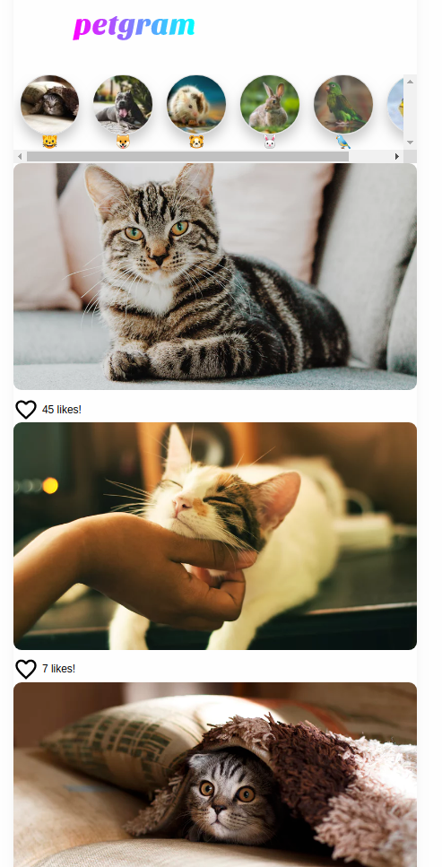

# Instagram para mascotas ⚛️

Repositorio con el código del [Curso Avanzado de React de Platzi](https://platzi.com/c/seba/)

Una pequeña app que simula un instagram para mascotas con React usando Hooks

## [Link now](https://geounity.sebastiancardoso92.now.sh)

## ¿Cómo funciona?

Requiere Node.Js 10

* `npm i` para instalar las dependencias
* `npm run dev` para el entorno de desarrollo
* `npm run build && npm start` para el entorno de produccion

## Licencia

MIT

## Author

Sebastian Cardoso Castillo (sebastiancardoso92@gmail.com)

...
